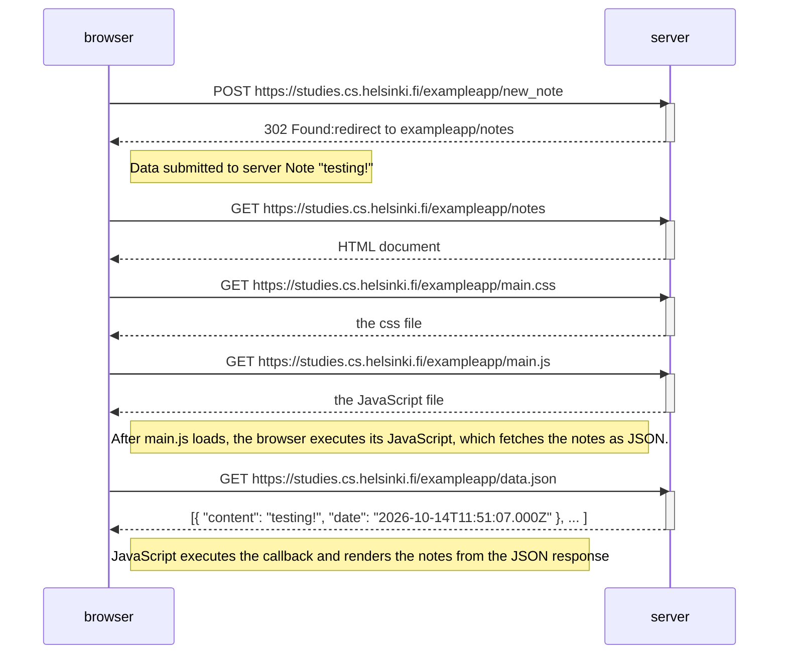

```mermaid
sequenceDiagram
    participant browser
    participant server

    browser->>server: POST https://studies.cs.helsinki.fi/exampleapp/new_note
    activate server
    server-->>browser: 302 Found:redirect to exampleapp/notes
    deactivate server

    Note right of browser: Data submitted to server Note "testing!"

    browser->>server: GET https://studies.cs.helsinki.fi/exampleapp/notes
    activate server
    server-->>browser: HTML document
    deactivate server

    browser->>server: GET https://studies.cs.helsinki.fi/exampleapp/main.css
    activate server
    server-->>browser: the css file
    deactivate server

    browser->>server: GET https://studies.cs.helsinki.fi/exampleapp/main.js
    activate server
    server-->>browser: the JavaScript file
    deactivate server

    Note right of browser: After main.js loads, the browser executes its JavaScript, which fetches the notes as JSON.

    browser->>server: GET https://studies.cs.helsinki.fi/exampleapp/data.json
    activate server
    server-->>browser: [{ "content": "testing!", "date": "2026-10-14T11:51:07.000Z" }, ... ]
    deactivate server

    Note right of browser: JavaScript executes the callback and renders the notes from the JSON response   
```