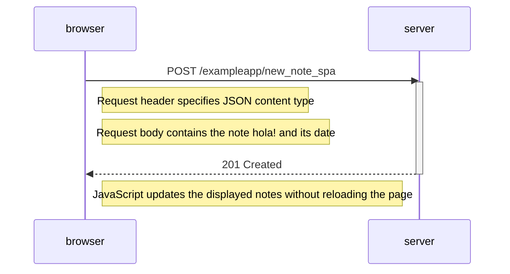

```mermaid
sequenceDiagram
    participant browser
    participant server

    browser->>server: POST /exampleapp/new_note_spa
    activate server

    Note right of browser: Request header specifies JSON content type
    Note right of browser: Request body contains the note hola! and its date

    server-->>browser: 201 Created
    deactivate server

    Note right of browser: JavaScript updates the displayed notes without reloading the page
```